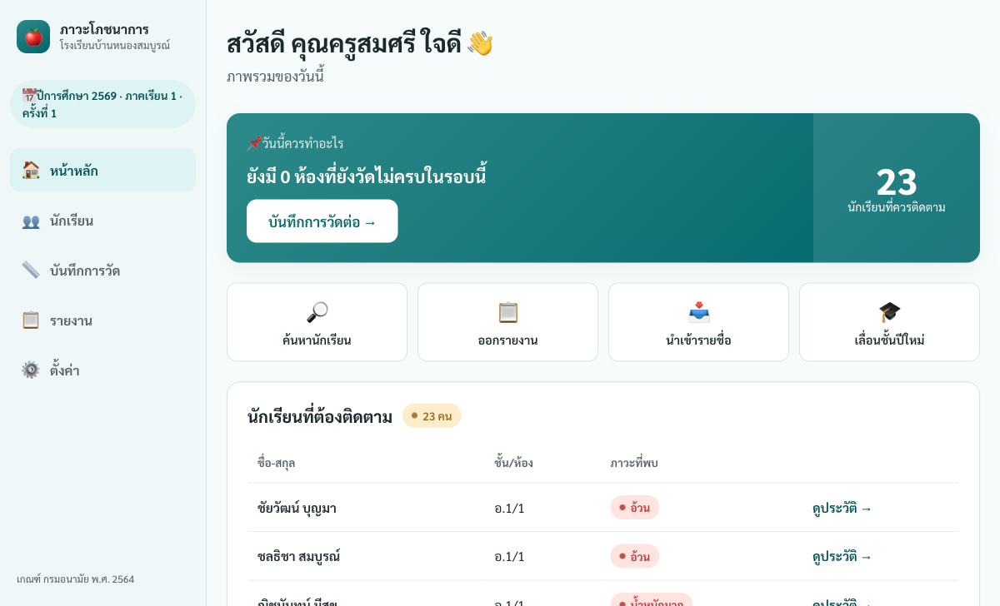
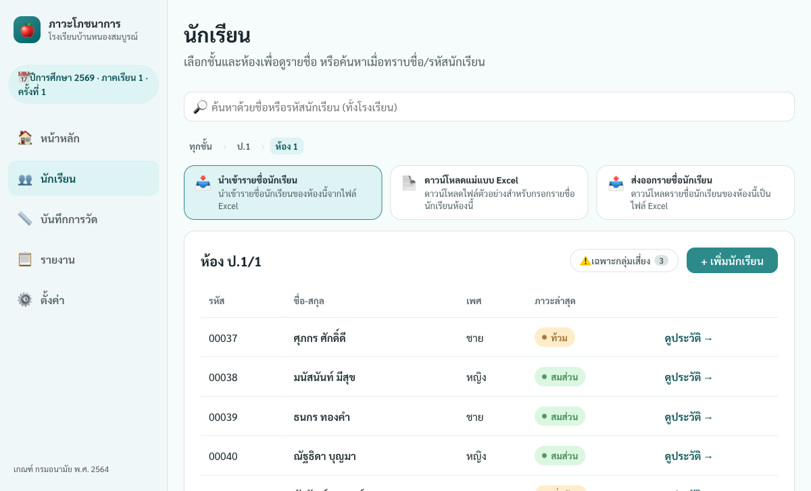
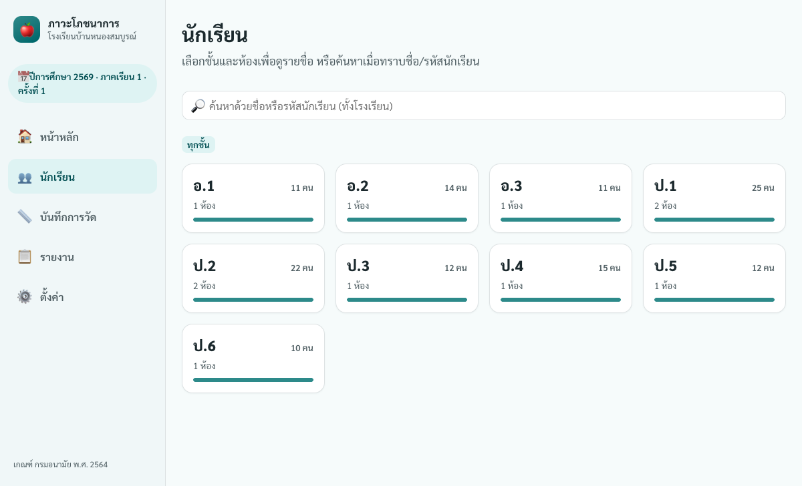
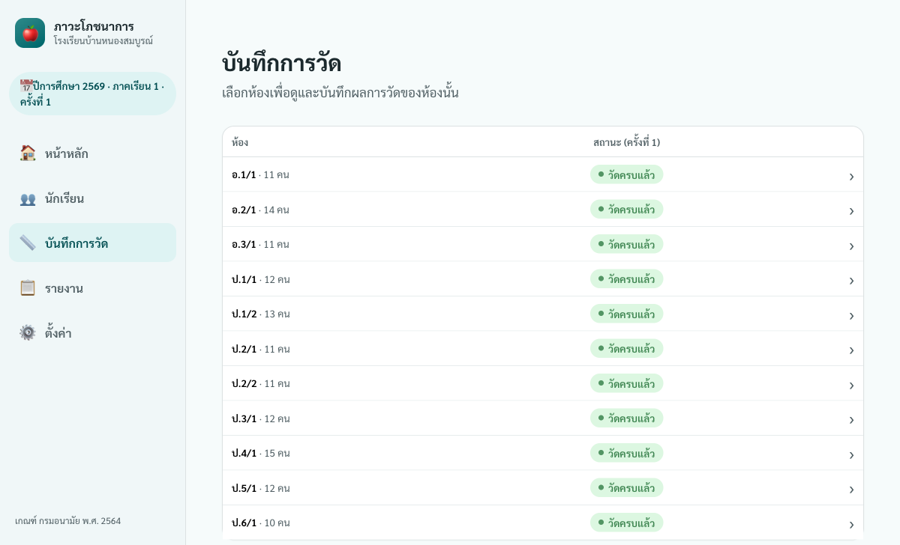
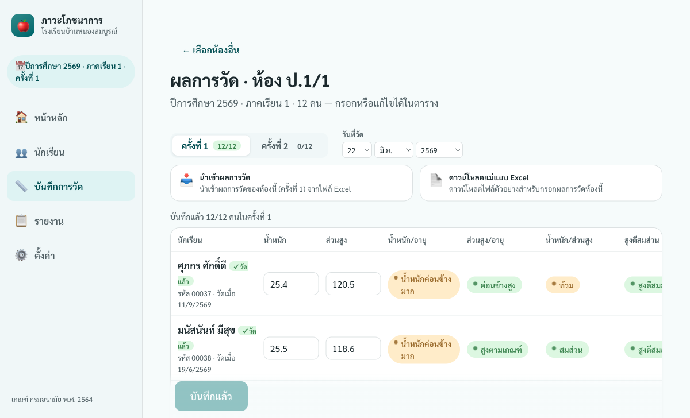
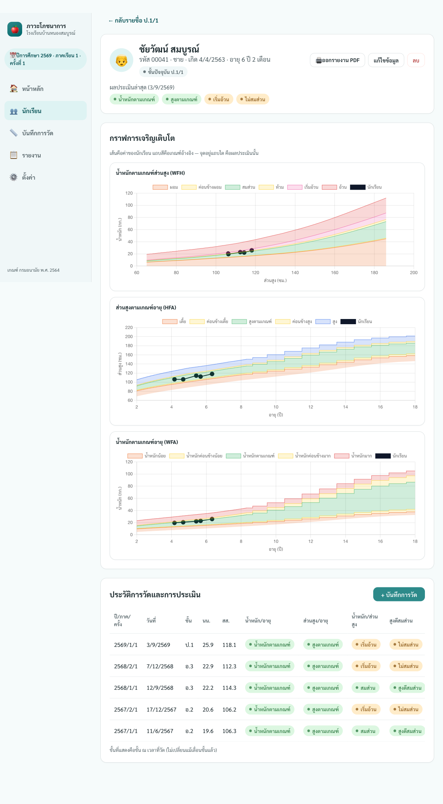
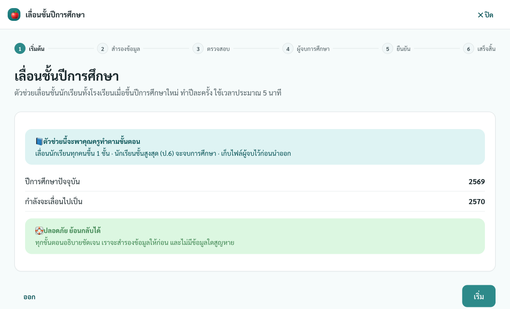
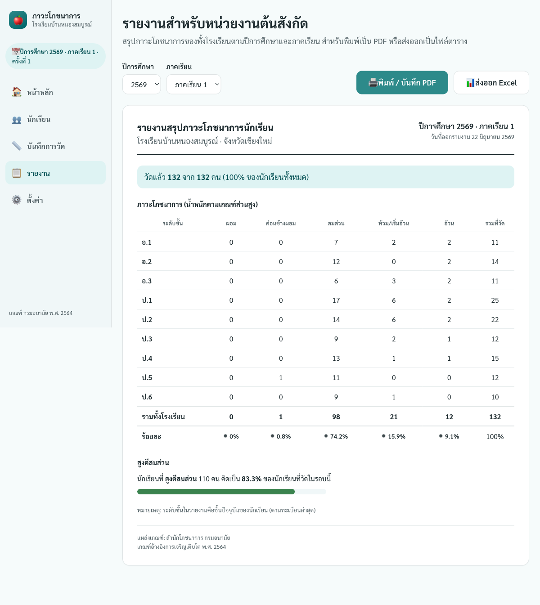
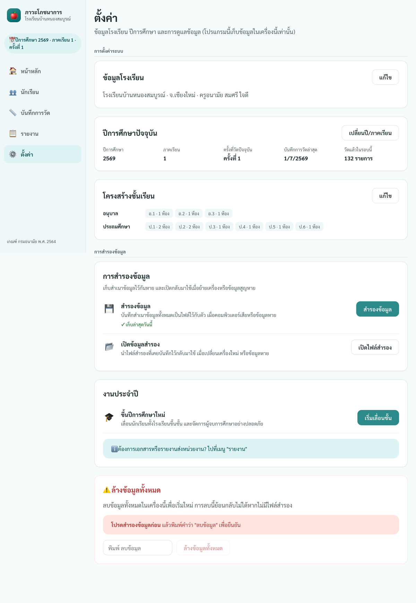

# คู่มือการใช้งาน — ระบบติดตามภาวะโภชนาการนักเรียน

คู่มือนี้เขียนสำหรับคุณครูอนามัยโรงเรียน เพื่อใช้งานโปรแกรมตั้งแต่เริ่มต้นจนครบรอบหนึ่งปีการศึกษา
อ่านไล่ตามลำดับได้เลยในครั้งแรก หรือเปิดเฉพาะหัวข้อที่ต้องการใช้เป็นคู่มืออ้างอิงก็ได้

---

## 1. ภาพรวมระบบ

**โปรแกรมนี้ช่วยอะไร**
ใช้บันทึกน้ำหนักและส่วนสูงของนักเรียน แล้วประเมินภาวะโภชนาการให้อัตโนมัติตามเกณฑ์อ้างอิง
การเจริญเติบโตของกรมอนามัย (พ.ศ. 2564) ติดตามการเติบโตของเด็กแต่ละคนตามเวลา
ออกรายงานสรุปส่งหน่วยงาน และจัดการการเลื่อนชั้นเมื่อขึ้นปีการศึกษาใหม่

**สิ่งที่ควรเข้าใจก่อนเริ่ม**

- โปรแกรมทำงานบนเครื่องของคุณครูโดยตรง **ไม่ต้องต่ออินเทอร์เน็ต** ขณะใช้งาน
- ข้อมูลทั้งหมด **เก็บอยู่ในเครื่องนี้เครื่องเดียว** ไม่ได้ส่งขึ้นออนไลน์ที่ไหน
  จึงควรสำรองข้อมูลเป็นไฟล์ไว้เสมอ (ดูหัวข้อ 9)
- ใช้ได้ทั้งบนคอมพิวเตอร์ แท็บเล็ต และ iPad

**เมนูหลัก 5 เมนู** (อยู่ด้านข้างหรือด้านล่างของจอ)

| เมนู | ใช้ทำอะไร |
|------|-----------|
| 🏠 หน้าหลัก | ดูว่าวันนี้ควรทำอะไร และดูนักเรียนที่ต้องติดตาม |
| 👥 นักเรียน | ดูรายชื่อตามชั้น/ห้อง ค้นหา และดูประวัติรายคน |
| 📏 บันทึกการวัด | กรอกน้ำหนัก/ส่วนสูงของแต่ละห้อง |
| 📋 รายงาน | ออกรายงานสรุปเพื่อพิมพ์หรือส่งหน่วยงาน |
| ⚙️ ตั้งค่า | แก้ข้อมูลโรงเรียน เปลี่ยนปีการศึกษา สำรอง/กู้คืนข้อมูล |

---

## 2. ครั้งแรก — ตั้งค่าโรงเรียน

**คุณครูต้องการทำอะไร:** เตรียมโปรแกรมให้พร้อมใช้งานครั้งแรก

**ไปที่ไหน:** เมื่อเปิดโปรแกรมครั้งแรก ระบบจะพาเข้าหน้าตั้งค่าให้เองโดยอัตโนมัติ
เป็นตัวช่วยแบบทีละขั้น (มีแถบบอกขั้นตอนด้านบน) ทั้งหมด **5 ขั้น**

1. **ข้อมูลโรงเรียน** — กรอกชื่อโรงเรียน สังกัด ที่อยู่ ชื่อครูอนามัย และเลือก
   "ชั้นสูงสุดของโรงเรียน" (เช่น ป.6 หรือ ม.3) ชั้นนี้คือชั้นที่นักเรียนจะ
   จบการศึกษาเมื่อเลื่อนชั้น ข้อมูลนี้จะไปแสดงบนหัวโปรแกรมและในรายงาน กรอกครั้งเดียว แก้ทีหลังได้
2. **ปีการศึกษา** — ระบบเดาปีและภาคเรียนให้แล้วจากวันที่ปัจจุบัน ตรวจดูให้ถูกต้อง
   (ปีการศึกษาเป็น พ.ศ.) แล้วไปต่อ
3. **โครงสร้างชั้นเรียน** — ระบุจำนวนห้องของแต่ละชั้น เพื่อให้นำเข้านักเรียนทีละห้องได้ง่าย
   เพิ่ม/ลดห้องภายหลังได้
4. **นำเข้านักเรียน** — เพิ่มรายชื่อนักเรียนเข้าแต่ละห้อง (ดูวิธีในหัวข้อ 3)
   ขั้นนี้ **ไม่จำเป็นต้องครบทุกห้องตอนนี้** เพิ่มเพิ่มเติมภายหลังได้เสมอ
5. **พร้อมใช้งาน** — สรุปสิ่งที่ตั้งค่าเสร็จ

**จบแล้วเกิดอะไร:** โปรแกรมพร้อมใช้งาน กดเริ่มบันทึกการวัด หรือไปหน้าหลักได้ทันที
ครั้งต่อ ๆ ไปจะเข้าหน้าหลักเลยโดยไม่ต้องตั้งค่าซ้ำ

> 💡 อยากแก้ข้อมูลโรงเรียน ปีการศึกษา หรือโครงสร้างห้องภายหลัง ไปที่เมนู **ตั้งค่า** ได้ตลอด

---

## 3. นำเข้ารายชื่อนักเรียน

**คุณครูต้องการทำอะไร:** เพิ่มรายชื่อนักเรียนเข้าระบบ

**ไปที่ไหน:** ทำได้ในขั้นตอนตั้งค่าครั้งแรก (ขั้นที่ 4) หรือภายหลังที่เมนู **นักเรียน**
โดยเข้าไปในห้องที่ต้องการ

มี 2 วิธี:

**วิธีที่ 1 — นำเข้าจากไฟล์ Excel (เหมาะกับทั้งห้อง)**

1. กด **ดาวน์โหลดแม่แบบ Excel** จะได้ไฟล์ตัวอย่างที่มีหัวตารางครบ
2. กรอกรายชื่อนักเรียนลงในไฟล์ (รหัสนักเรียน ชื่อ นามสกุล วันเกิด เพศ)
3. กด **นำเข้า Excel** แล้วเลือกไฟล์ที่กรอกเสร็จ

**วิธีที่ 2 — เพิ่มทีละคน (เหมาะกับเพิ่มเด็กใหม่ไม่กี่คน)**

กด **เพิ่มทีละคน** ในห้องนั้น แล้วกรอกฟอร์ม: รหัสนักเรียน ชื่อ นามสกุล วันเกิด เพศ
วันเกิดกรอกแบบไทย วัน/เดือน/ปีพ.ศ. เช่น `15/05/2556`

**เห็นอะไร:** เมื่อเข้าไปในห้อง จะมีปุ่มนำเข้า/ดาวน์โหลดแม่แบบ/ส่งออก อยู่ด้านบนรายชื่อ

**จบแล้วเกิดอะไร:** รายชื่อเข้าระบบทันที พร้อมให้บันทึกการวัด ระบบจะเตือนถ้ารหัสนักเรียนซ้ำ

---

## 4. ดูนักเรียนตามชั้น/ห้อง

**คุณครูต้องการทำอะไร:** เปิดดูว่าห้องไหนมีใครบ้าง และสถานะโภชนาการเป็นอย่างไร

**ไปที่ไหน:** เมนู **นักเรียน**

**เห็นอะไร:** หน้าจอไล่เป็น 3 ระดับ
1. เลือก **ชั้น** (เช่น ป.1, ป.2 …)
2. เลือก **ห้อง** ในชั้นนั้น
3. เห็น **รายชื่อนักเรียน** ในห้อง พร้อมป้ายสถานะของแต่ละคน
   (สมส่วน / ค่อนข้างผอม / ผอม / ท้วม / เริ่มอ้วน / อ้วน / ยังไม่วัด)

ในหน้ารายชื่อยังทำได้อีก:
- **ค้นหา** นักเรียนด้วยรหัสหรือชื่อ
- กรอง **เฉพาะคนที่ต้องติดตาม** เพื่อดูเฉพาะเด็กที่อยู่นอกเกณฑ์
- **ส่งออก/นำเข้า** รายชื่อของห้องนั้นเป็น Excel

**จบแล้วเกิดอะไร:** กดที่ชื่อนักเรียนคนใดก็ได้เพื่อเปิดดูประวัติรายคน (หัวข้อ 6)

---

## 5. บันทึกการวัด

**คุณครูต้องการทำอะไร:** กรอกน้ำหนักและส่วนสูงของนักเรียนแต่ละห้อง

**ไปที่ไหน:** เมนู **บันทึกการวัด**

**ขั้นตอน:**

1. **เลือกห้อง** — หน้าแรกแสดงทุกห้อง พร้อมสถานะว่าวัดครบหรือยัง
   (ยังไม่วัด / วัดแล้ว x/y / วัดครบแล้ว) กดเลือกห้องที่ต้องการ

   

2. **เลือกครั้งที่วัด** — มี ครั้งที่ 1 และ ครั้งที่ 2 (เลือกด้วยแท็บด้านบนตาราง)
   โดยปกติเทอมหนึ่งวัด 2 ครั้ง
3. **ตรวจวันที่วัด** — ระบบใส่วันที่วันนี้ให้ แก้ได้ถ้าวัดย้อนหลัง
4. **กรอกน้ำหนักและส่วนสูง** ของนักเรียนทีละคนในตาราง

**เห็นอะไร:** ทันทีที่กรอกครบทั้งน้ำหนักและส่วนสูง ระบบจะประเมินและแสดงผล 4 ด้านในแถวเดียวกัน
- น้ำหนักตามเกณฑ์อายุ
- ส่วนสูงตามเกณฑ์อายุ
- น้ำหนักตามเกณฑ์ส่วนสูง
- สูงดีสมส่วน (ใช่ / ไม่ใช่)

ช่องที่เพิ่งแก้จะถูกไฮไลต์ และด้านล่างบอกว่ามีกี่รายการที่ยังไม่บันทึก

> 💡 มีผลการวัดในไฟล์ Excel อยู่แล้วก็นำเข้าได้ ด้วยปุ่ม **นำเข้าผลการวัด** (มีแม่แบบให้ดาวน์โหลด)

**จบแล้วเกิดอะไร:** กด **บันทึก** ที่แถบด้านล่าง ระบบบันทึกเฉพาะรายการที่กรอก/แก้ไข
และขึ้นข้อความยืนยัน กลับไปเลือกห้องอื่นเพื่อวัดต่อได้

---

## 6. ดูประวัติรายบุคคล และกราฟการเจริญเติบโต

**คุณครูต้องการทำอะไร:** ดูพัฒนาการของนักเรียนคนหนึ่งตามเวลา

**ไปที่ไหน:** เมนู **นักเรียน** แล้วกดที่ชื่อนักเรียน (หรือกดจากรายการ "ต้องติดตาม" ในหน้าหลัก)

**เห็นอะไร:**
- ข้อมูลพื้นฐาน: ชื่อ ชั้น/ห้อง อายุ
- **ผลการวัดล่าสุด** พร้อมการประเมินภาวะโภชนาการ
- **กราฟการเจริญเติบโต** 3 ใบ วางทับเส้นเกณฑ์อ้างอิงของกรมอนามัย
  - น้ำหนักตามเกณฑ์ส่วนสูง
  - ส่วนสูงตามเกณฑ์อายุ
  - น้ำหนักตามเกณฑ์อายุ
- **ประวัติการวัดทั้งหมด** เรียงตามปี/ภาคเรียน/ครั้งที่

**จบแล้วเกิดอะไร:** พิมพ์ประวัติของนักเรียนคนนี้เก็บหรือแจ้งผู้ปกครองได้ แล้วปิดกลับไปดูคนอื่นต่อ

---

## 7. เปลี่ยนปีการศึกษา (เลื่อนชั้น)

**คุณครูต้องการทำอะไร:** ขึ้นปีการศึกษาใหม่ — เลื่อนนักเรียนทั้งโรงเรียนขึ้นชั้น และจัดการผู้จบการศึกษา
งานนี้ทำ **ปีละครั้ง** ใช้เวลาประมาณ 5 นาที

**ไปที่ไหน:** เมนู **ตั้งค่า** → หัวข้อ "งานประจำปี" → กด **เริ่มเลื่อนชั้น**
(หรือทางลัด "เลื่อนชั้นปีใหม่" ในหน้าหลัก) เป็นตัวช่วยทีละขั้น **6 ขั้น**

1. **เริ่มต้น** — อธิบายว่าจะเกิดอะไร: ทุกคนเลื่อนขึ้น 1 ชั้น นักเรียนชั้นสูงสุดจะจบการศึกษา
2. **สำรองข้อมูล** — กดบันทึกไฟล์สำรองก่อน (บังคับ) เพื่อความปลอดภัย ต้องทำก่อนจึงไปต่อได้
3. **ตรวจสอบการเลื่อนชั้น** — ดูสรุปว่าชั้นเดิมแต่ละชั้นจะกลายเป็นชั้นใหม่อะไร
   ค่าเริ่มต้นคือเลื่อนทุกคน ถ้ามีกรณีพิเศษ (ให้ซ้ำชั้น หรือย้ายห้อง)
   ค้นหานักเรียนคนนั้นแล้วปรับเฉพาะคนได้
4. **ผู้จบการศึกษา** — นักเรียนชั้นสูงสุดจะถูกนำออกจากทะเบียน **ต้องดาวน์โหลดไฟล์เก็บก่อน**
   (ไฟล์มีรายชื่อ + ประวัติการวัดครบทั้งหมด) ปุ่มถัดไปจะใช้ได้หลังดาวน์โหลดเสร็จ
5. **ยืนยัน** — ตรวจสรุปอีกครั้ง: เลื่อนกี่คน ซ้ำชั้นกี่คน จบกี่คน ปีใหม่คือปีอะไร
6. **เสร็จสิ้น** — เลื่อนชั้นเรียบร้อย เข้าสู่ปีการศึกษาใหม่

**จบแล้วเกิดอะไร:**
- นักเรียนเดิมทุกคนเลื่อนชั้นให้อัตโนมัติ **ไม่ต้องนำเข้าใหม่**
- ผู้จบการศึกษาถูกนำออกจากทะเบียน (แต่เก็บไว้ในไฟล์แล้ว — ข้อมูลถูกย้าย ไม่ได้หาย)
- ปีการศึกษาเปลี่ยนเป็นปีใหม่ ภาคเรียน 1 อัตโนมัติ
- ถ้ามีนักเรียน **เข้าใหม่** (เช่น ป.1/อ.1 ใหม่ หรือเด็กย้ายเข้า) จึงค่อยนำเข้าเฉพาะคนใหม่

> 🛟 ตัวช่วยนี้ออกแบบให้ปลอดภัย: สำรองข้อมูลก่อนเสมอ และพิสูจน์ว่าเก็บไฟล์ผู้จบแล้วก่อนนำใครออก

---

## 8. ออกรายงานส่งหน่วยงาน

**คุณครูต้องการทำอะไร:** สรุปภาวะโภชนาการของทั้งโรงเรียนเพื่อพิมพ์หรือส่งหน่วยงานต้นสังกัด

**ไปที่ไหน:** เมนู **รายงาน**

**ขั้นตอน:**
1. เลือก **ปีการศึกษา** และ **ภาคเรียน** ที่ต้องการสรุป
2. ดูตัวอย่างเอกสารบนจอ — เป็นหน้าตาเดียวกับที่จะพิมพ์ออกมา

**เห็นอะไร:** เอกสารสรุปประกอบด้วย
- หัวรายงาน: ชื่อโรงเรียน จังหวัด ปี/ภาคเรียน วันที่ออกรายงาน
- จำนวนที่วัดแล้วเทียบกับนักเรียนทั้งหมด (เปอร์เซ็นต์ความครอบคลุม)
- ตารางภาวะโภชนาการแยกตามระดับชั้น และร้อยละรวมทั้งโรงเรียน
- จำนวนและร้อยละของนักเรียน "สูงดีสมส่วน"
- แหล่งอ้างอิงเกณฑ์ (กรมอนามัย พ.ศ. 2564)

**จบแล้วเกิดอะไร:** เลือกได้ 2 แบบ
- **🖨️ พิมพ์ / บันทึก PDF** — พิมพ์ลงกระดาษ หรือบันทึกเป็นไฟล์ PDF
- **📊 ส่งออก Excel** — ได้ไฟล์ตารางไว้แก้ไขหรือส่งต่อ

---

## 9. สำรองและกู้คืนข้อมูล

เพราะข้อมูลเก็บอยู่ในเครื่องนี้เครื่องเดียว การสำรองไฟล์ไว้สม่ำเสมอจึงสำคัญมาก
หากเครื่องเสียหรือข้อมูลหาย ไฟล์สำรองคือสิ่งเดียวที่นำข้อมูลกลับมาได้

**ไปที่ไหน:** เมนู **ตั้งค่า** → หัวข้อ "การสำรองข้อมูล"

**สำรองข้อมูล**
- กด **สำรองข้อมูล** จะได้ไฟล์ลงเครื่อง (เก็บข้อมูลทั้งหมด)
- หน้าจอบอกว่าเก็บล่าสุดเมื่อใด และเตือนเป็นสีถ้าไม่ได้สำรองมานาน
- เก็บไฟล์นี้ไว้ในที่ปลอดภัย เช่น แฟลชไดรฟ์ หรือคลาวด์ส่วนตัว

**เปิดข้อมูลสำรอง (กู้คืน)**
- ใช้เมื่อเปลี่ยนเครื่องใหม่ หรือข้อมูลหาย
- กด **เปิดไฟล์สำรอง** แล้วเลือกไฟล์ที่เคยบันทึกไว้
- ⚠️ การกู้คืนจะ **แทนที่ข้อมูลในเครื่องนี้ทั้งหมด** ระบบจะให้ยืนยันก่อน
  ควรสำรองข้อมูลปัจจุบันไว้ก่อนทุกครั้ง

**จบแล้วเกิดอะไร:** หลังกู้คืน โปรแกรมโหลดข้อมูลจากไฟล์สำรองขึ้นมาใช้แทนของเดิม

> ⚠️ หัวข้อ "ล้างข้อมูลทั้งหมด" ในหน้าตั้งค่าจะลบทุกอย่างถาวร ใช้เฉพาะเมื่อต้องการเริ่มใหม่จริง ๆ
> และต้องสำรองข้อมูลไว้ก่อนเสมอ

---

## 10. หน้าหลัก (แดชบอร์ด)

**คุณครูต้องการทำอะไร:** ดูภาพรวมว่าวันนี้ควรทำอะไร

**ไปที่ไหน:** เมนู **หน้าหลัก** (เปิดโปรแกรมมาจะเจอหน้านี้ก่อน)

**เห็นอะไร:**
- คำทักทายพร้อมชื่อคุณครู
- กล่อง **"วันนี้ควรทำอะไร"** — บอกว่ายังมีกี่ห้องที่วัดไม่ครบ พร้อมปุ่มบันทึกการวัดต่อ
- จำนวน **นักเรียนที่ควรติดตาม**
- ทางลัด: ค้นหานักเรียน · ออกรายงาน · นำเข้ารายชื่อ · เลื่อนชั้นปีใหม่
- ตาราง **นักเรียนที่ต้องติดตาม** — เด็กที่อยู่นอกเกณฑ์ กดดูประวัติได้ทันที

**จบแล้วเกิดอะไร:** หน้าหลักเป็นจุดเริ่มของทุกงาน กดจากที่นี่ไปยังงานที่ต้องทำได้เลย

---

## รอบการทำงานหนึ่งปีการศึกษา (สรุปย่อ)

1. ตั้งค่าโรงเรียนและนำเข้านักเรียน (ทำครั้งแรกครั้งเดียว)
2. ภาคเรียนที่ 1 — บันทึกการวัด ครั้งที่ 1 และ ครั้งที่ 2
3. ออกรายงานสรุปส่งหน่วยงาน
4. ภาคเรียนที่ 2 — บันทึกการวัดอีก 2 ครั้ง และออกรายงาน
5. ปลายปี — เลื่อนชั้นขึ้นปีการศึกษาใหม่
6. **สำรองข้อมูลสม่ำเสมอตลอดทั้งปี**
